---
# 📖 **Super Simple Network Protocol Security Lab Guide**

---

## 🎯 1. What’s The Lab For?
We’re pretending to be a hacker:
- **Kali Linux** = hacker’s laptop  
- **Metasploitable 2** = old computer with weak security (target)  

We will:
- Find open “doors” (ports)  
- Try to guess passwords  
- Watch how data moves (sniff)  
- See which are safe, and which are not  

---

## 🖥️ 2. Setting Up
Make sure:
- **Kali Linux** running  
- **Metasploitable 2** running  
- Both connected in the same VirtualBox/VMWare network (Host-Only or Bridged)

---

## 🕵️ 3. Find Open Services (Scanning)

**Command**:
```bash
nmap -sC -sV -p 21,22,23,80 <TARGET_IP>
```
**What this means**:  
- Check if ports **21 (FTP)**, **22 (SSH)**, **23 (Telnet)**, **80 (Web)** are open.
- See what’s behind the doors.

✅ *If open, they’ll show something like:*
```
21/tcp open  ftp
22/tcp open  ssh
23/tcp open  telnet
80/tcp open  http
```
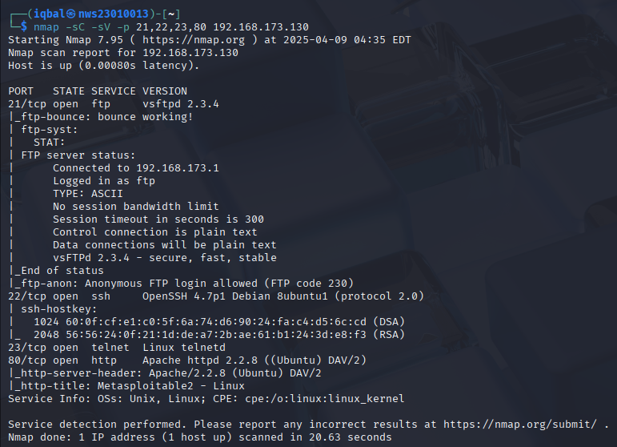

---

## 📃 4. Find Usernames (Enumerating)

**Command**:
```bash
enum4linux -a <TARGET_IP>
```
**What this does**:  
- Ask the computer: *“Hey, what usernames do you have?”*
- You’ll get names like:
```
msfadmin
user
postgres
```
**Remember these — we’ll need them to guess passwords!**

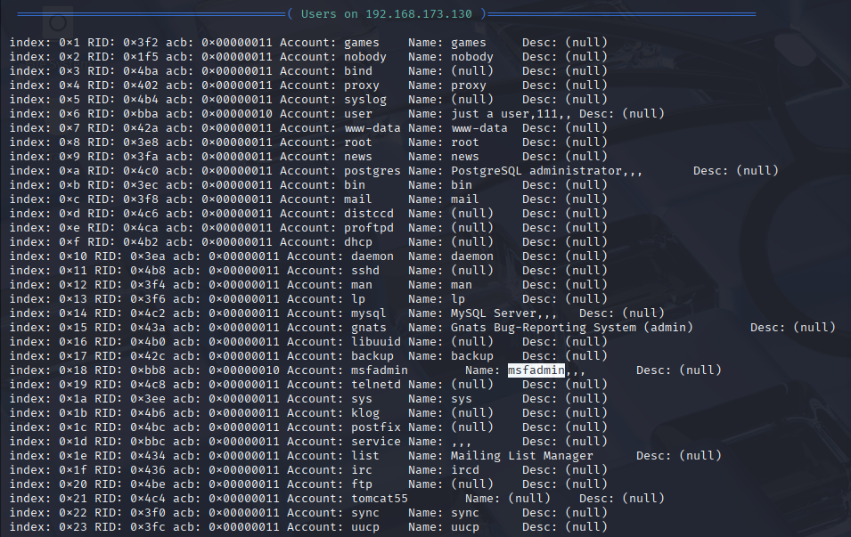
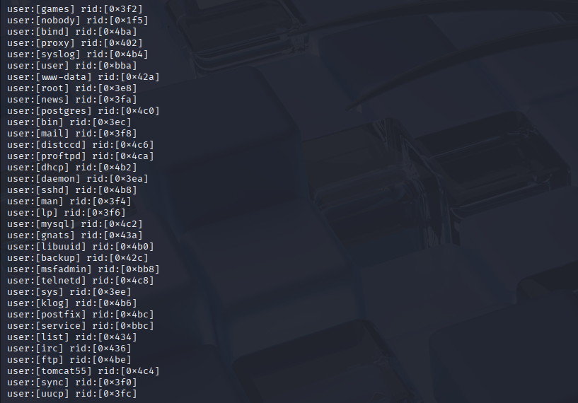
---

## 🌐 5. Check for Hidden Web Pages (Gobuster)

**Command**:
```bash
gobuster dir -u http://<TARGET_IP> -w /usr/share/wordlists/dirb/common.txt
```
**What this does**:  
- Tries lots of website addresses like `/login`, `/admin`, `/upload`
- Finds secret pages

✅ *Look for good stuff like `/login`*

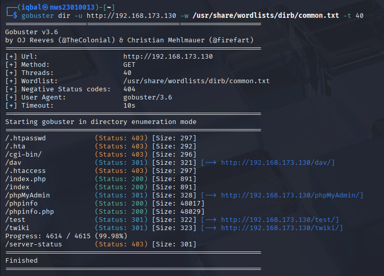

---

## 🔓 6. Brute Force Passwords (Guess Passwords)

Got it — you want the note to be super simple and clear. Here's a more casual, easy-to-understand version of the note:

---

### ✏️ Prepare files first:
```bash
echo -e "admin\nmsfadmin\nuser" > userlist.txt
echo -e "1234\nmsfadmin\npassword" > passlist.txt
```
Now we have:
- A list of usernames in `userlist.txt`
- A list of passwords in `passlist.txt`

---

### 📂 Or use Kali's default wordlist:
```bash
/usr/share/wordlists/rockyou.txt
```

> 📝 **Note:**  
> `rockyou.txt` is a big list of real passwords. It’s already on Kali.  
> Use it when you want to try **lots of possible passwords**.  
> But it’s slow — so for testing or practice, it’s better to use your **own small list** (like above).

---

### 6.1 📁 FTP Brute Force
```bash
hydra -L userlist.txt -P passlist.txt <TARGET_IP> ftp -V
```
✅ *If lucky, you’ll get something like:*
```
[21][ftp] host: 192.168.1.100  login: msfadmin  password: msfadmin
```

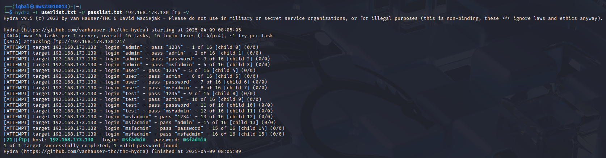

---

### 6.2 📞 TELNET Brute Force
```bash
hydra -L userlist.txt -P passlist.txt <TARGET_IP> telnet -V
```
Same idea — guess username & password for Telnet.

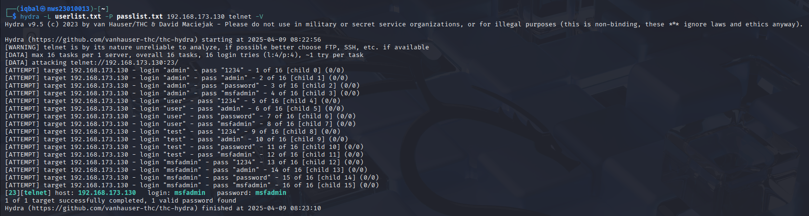

---

### 6.3 🔒 SSH Brute Force 
```bash
medusa -h <TARGET_IP> -U userlist.txt -P passlist.txt -M ssh
```
Check if any usernames & passwords work for SSH.

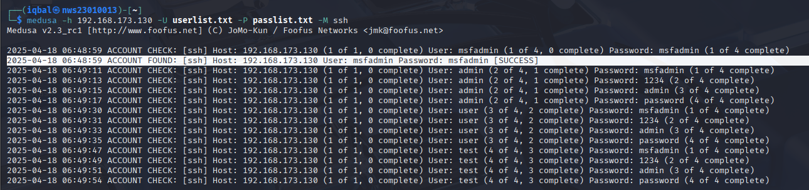

---

### 6.4 🌐 HTTP Login (Using Burp Suite)
**Steps:**
1. Open **Burp > Proxy > Intercept**  
2. Open Burp Browser  
3. Go to `http://<TARGET_IP>/login`  
4. Enter dummy login (like `test:test`)  
5. Capture the request  
6. Send to **Intruder**  
7. Set username and password positions  
8. Load `userlist.txt` and `passlist.txt`  
9. Start Attack  
10. Look for different responses = password found!

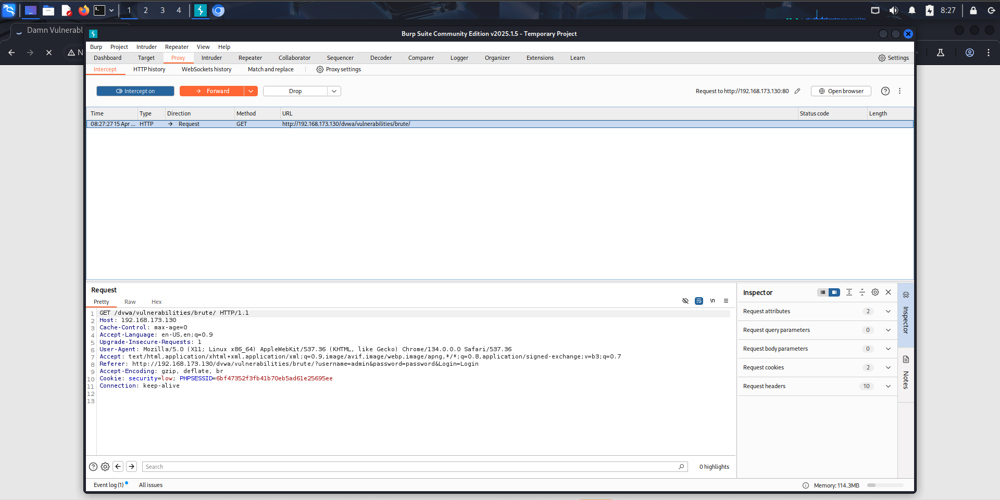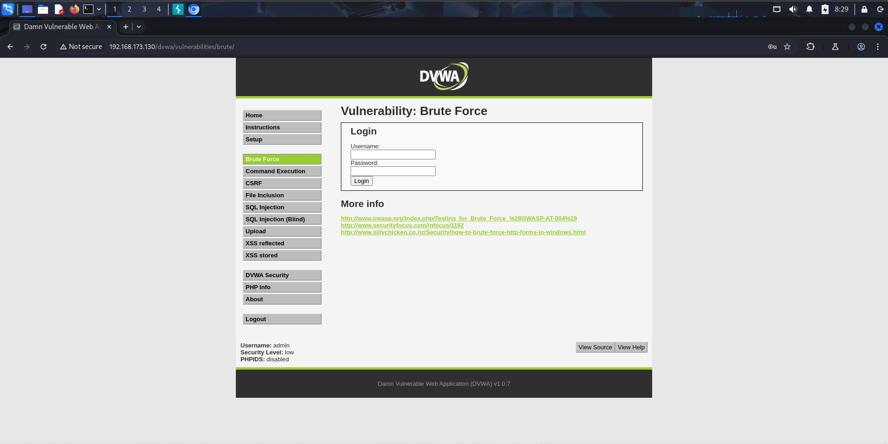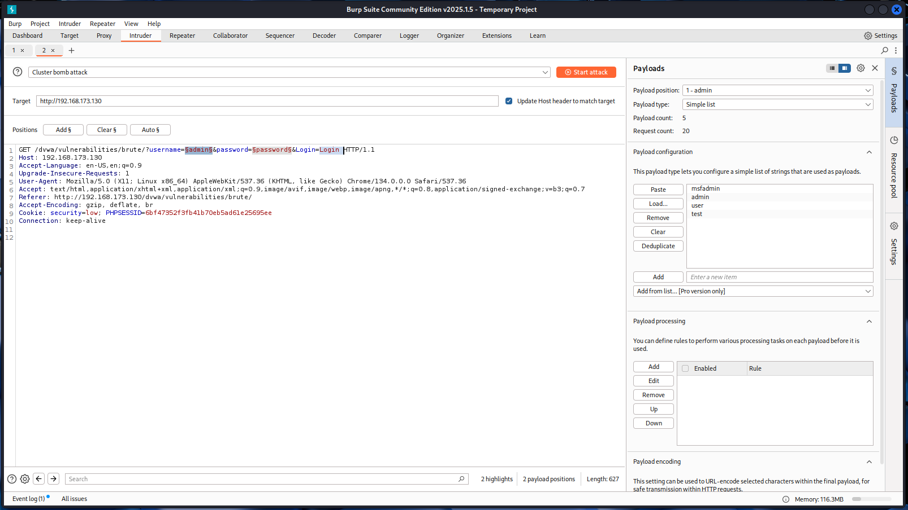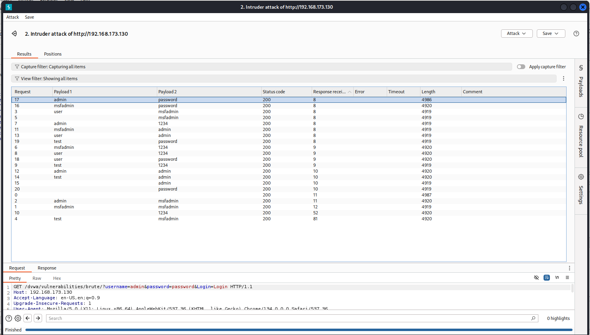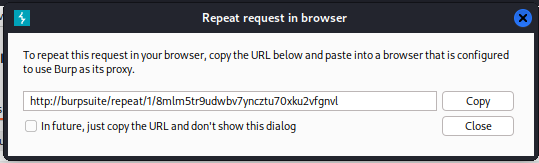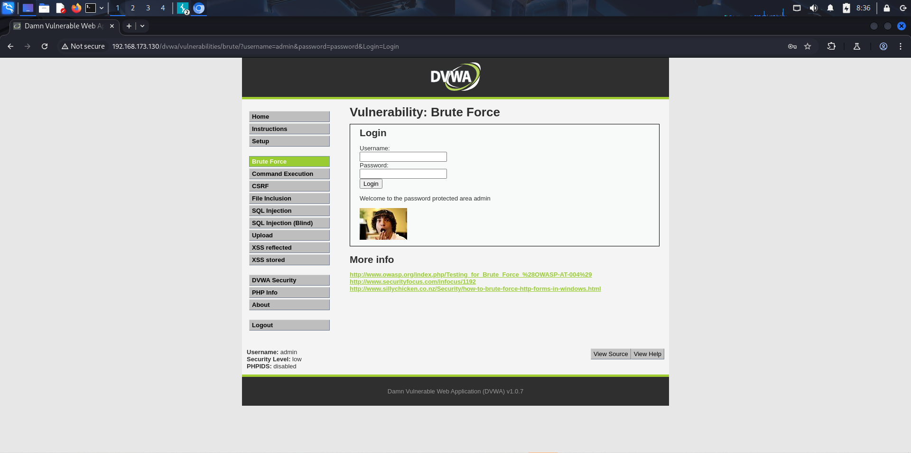

---

## 🐍 7. Sniffing (See What’s Inside The Data)

Use **Wireshark** to capture what’s being sent when you login.

**Steps**:
1. Open Wireshark  
2. Pick the right network (like `eth0` or `wlan0`)  
3. Start capture  

### Try logging in to:
- **FTP** → `ftp <TARGET_IP>` 
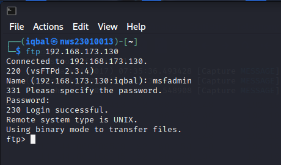

- **Telnet** → `telnet <TARGET_IP>` 
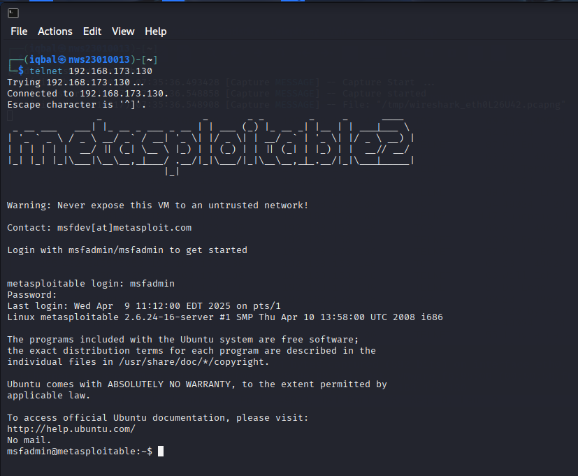

- **SSH** → `ssh <username>@<TARGET_IP>`  
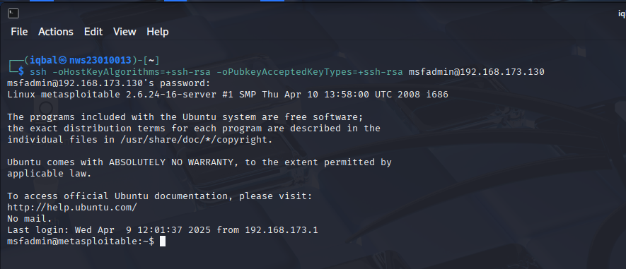

**Wireshark Filter**:
- `tcp.port == 21` (for FTP)
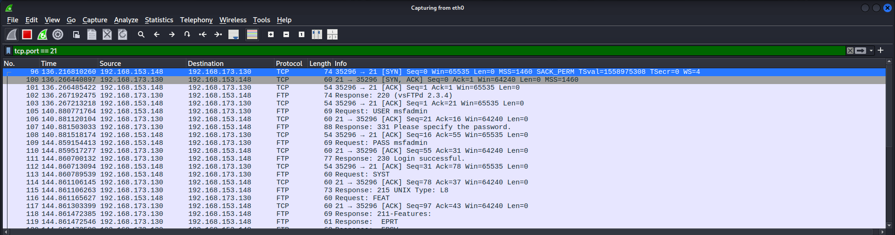
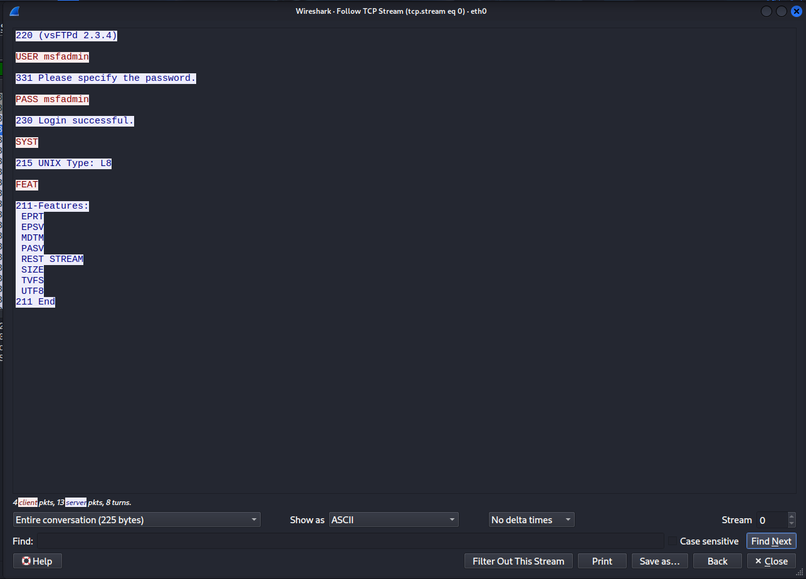 

- `tcp.port == 23` (for Telnet)
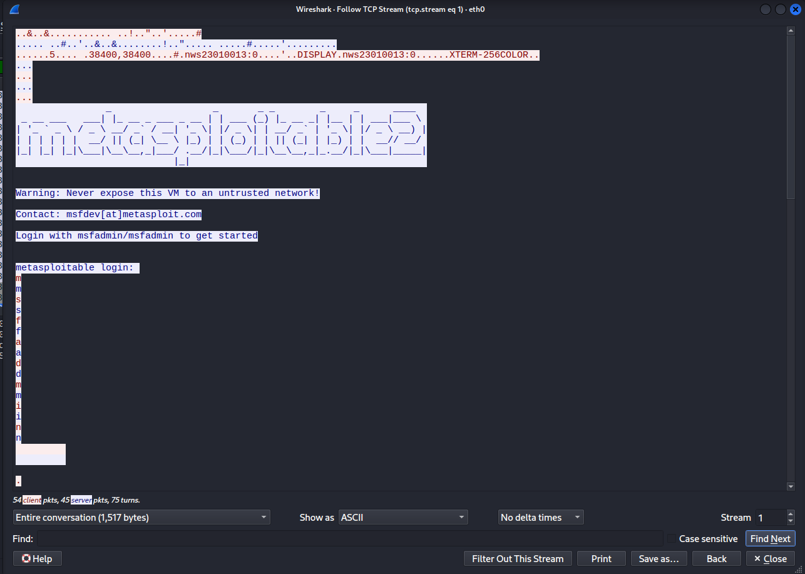
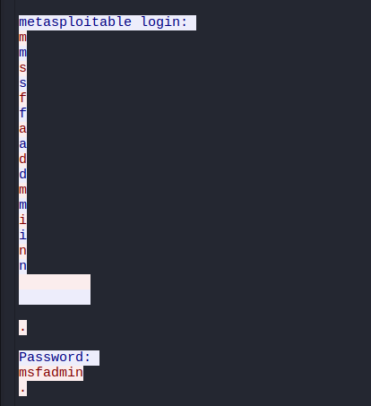 

- `tcp.port == 22` (for SSH)

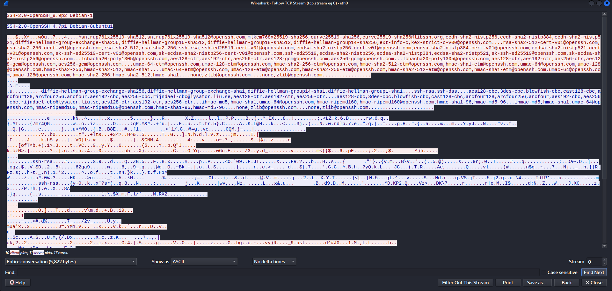

✅ *See if username and password appear in clear text (FTP and Telnet usually do). SSH is encrypted (cannot read).*

---

## 📝 8. Make a Result Table

| Protocol | Encryption | Are credentials visible? |
|:----------|:------------|:---------------------------|
| FTP      | ❌ No      | ✅ Yes                    |
| TELNET   | ❌ No      | ✅ Yes                    | 
| SSH      | ✅ Yes     | ❌ No                     | 

---

## 🔧 9. Common Problems

| Problem | Why | How to Fix |
|----------|-----|------------|
| Too fast guessing | Computer blocks you | Use `-t 1` to slow down |
| CAPTCHA on website | Blocked by form | Test manually |
| SSH blocks IP | Too many fails | Use proxy or VPN |

---

## 🛡️ 10. How To Fix These Problems (Mitigation)

| If using… | Problem | Replace with |
|:------------|:----------|:---------------|
| FTP | Passwords are in clear text | Use SFTP (secure) |
| TELNET | Everything visible | Use SSH |
| SSH | Can be brute forced | Use keys or 2FA |
| HTTP | Password sent insecurely | Use HTTPS |

---

## ✅ 11. Conclusion  
- You can guess passwords using tools like Hydra and NetExec  
- Some services (FTP, Telnet) send data in plain text (unsafe)  
- Others (SSH) are encrypted (safe)  
- The best way to stay safe is to:
  - Use encryption  
  - Avoid weak passwords  
  - Use key-based logins  