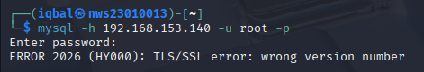
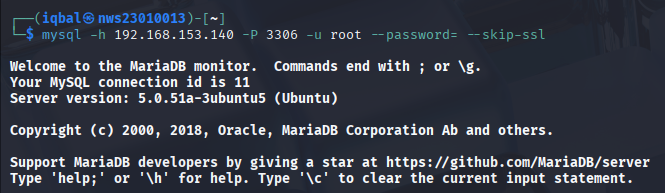
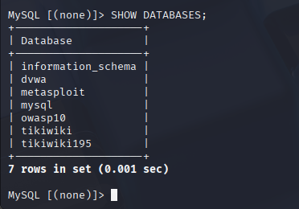
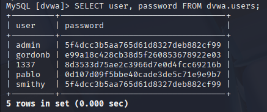
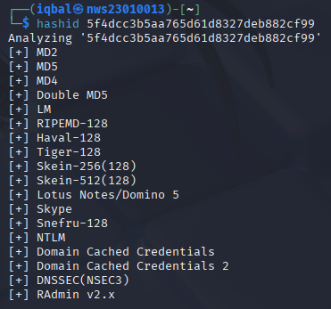
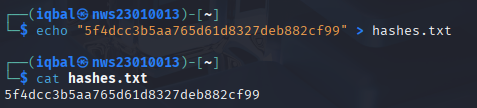

---
# 🎓 **Lab 2 — Beginner Edition: Hack the Database Like a Pro (Safely!)**

---

## 🧰 TOOLS YOU'LL USE (Imagine these are your hacking toys 🧸)

| Tool               | What it does (like a toy's power!)               |
|--------------------|--------------------------------------------------|
| **Kali Linux**     | Your hacker playground (like a superhero HQ)     |
| **nmap**           | Scans other computers to see open doors 🏠🔍     |
| **mysql-client**   | A way to talk to the database like a chat app 💬 |
| **hashid**         | Tells you what kind of password hash it is 🔍    |
| **John the Ripper**| Cracks passwords (like solving secret codes 🧠) |

---

## ✅ **PART 1: Service Enumeration and Initial Access**

**Goal:**  
➡️ Find out what database is on the victim machine and try to connect to it from Kali.

### 🔍 1.1 Check for Open Ports

```bash
nmap -sV [target-ip]
```

**Explanation:**
- `nmap` → Network scanner
- `-sV` → Show service version
- `[target-ip]` → Replace this with your victim machine IP
- Example:
```bash
nmap -sV 192.168.153.140
```

Look for output like:
```
3306/tcp open  mysql
5432/tcp open  postgresql
```

> ✅ You just confirmed MySQL is running on the victim!

**result screenshot:**
```
nmap -sV 192.168.153.140
Starting Nmap 7.95 ( https://nmap.org ) at 2025-04-23 03:16 EDT
Nmap scan report for 192.168.153.140
Host is up (0.00095s latency).
Not shown: 977 closed tcp ports (reset)
PORT     STATE SERVICE     VERSION
21/tcp   open  ftp         vsftpd 2.3.4
22/tcp   open  ssh         OpenSSH 4.7p1 Debian 8ubuntu1 (protocol 2.0)
23/tcp   open  telnet      Linux telnetd
25/tcp   open  smtp        Postfix smtpd
53/tcp   open  domain      ISC BIND 9.4.2
80/tcp   open  http        Apache httpd 2.2.8 ((Ubuntu) DAV/2)
111/tcp  open  rpcbind     2 (RPC #100000)
139/tcp  open  netbios-ssn Samba smbd 3.X - 4.X (workgroup: WORKGROUP)
445/tcp  open  netbios-ssn Samba smbd 3.X - 4.X (workgroup: WORKGROUP)
512/tcp  open  exec        netkit-rsh rexecd
513/tcp  open  login?
514/tcp  open  shell       Netkit rshd
1099/tcp open  java-rmi    GNU Classpath grmiregistry
1524/tcp open  bindshell   Metasploitable root shell
2049/tcp open  nfs         2-4 (RPC #100003)
2121/tcp open  ftp         ProFTPD 1.3.1
3306/tcp open  mysql       MySQL 5.0.51a-3ubuntu5                     👈
5432/tcp open  postgresql  PostgreSQL DB 8.3.0 - 8.3.7                👈
5900/tcp open  vnc         VNC (protocol 3.3)
6000/tcp open  X11         (access denied)
6667/tcp open  irc         UnrealIRCd
8009/tcp open  ajp13       Apache Jserv (Protocol v1.3)
8180/tcp open  http        Apache Tomcat/Coyote JSP engine 1.1
MAC Address: 00:0C:29:EA:B8:37 (VMware)
Service Info: Hosts:  metasploitable.localdomain, irc.Metasploitable.LAN; OSs: Unix, Linux; CPE: cpe:/o:linux:linux_kernel

Service detection performed. Please report any incorrect results at https://nmap.org/submit/ .
Nmap done: 1 IP address (1 host up) scanned in 35.29 seconds
```


---

### 🔑 1.2 Try Connecting to the Database

```bash
mysql -h [target-ip] -u root -p
```

- Example:
```bash
mysql -h 192.168.153.140 -P 3306 -u root -p
```
**Explanation:**
- `mysql` → Connect to MySQL
- `-h` → Host (IP address of victim)
- `-u` → Username
- `-p` → Prompt for password (or leave blank)

You might get errors like:
```sh
TLS/SSL error: wrong version number
```
- You might get an **Access Denied** error.
- Or it might let you in without a password (this is a cryptographic problem).

**result screenshot:**
```sh
mysql -h 192.168.153.140 -P 3306 -u root -p
Enter password:
WARNING: option --ssl-verify-server-cert is disabled, because of an insecure passwordless login.

ERROR 2026 (HY000): TLS/SSL error: wrong version number
```


### 📋 1.3 Try Without SSL or Password

```bash
mysql -h [target-ip] -P 3306 -u root --password= --skip-ssl
```

**Success!** Connected to the MySQL service:
```sql
Welcome to the MariaDB monitor...
Server version: 5.0.51a-3ubuntu5 (Ubuntu)
```

> ✅ You’re in! That’s a big misconfiguration — root with no password!

### 🧠 Explanation:

- The **MySQL client tried to use TLS/SSL by default**, but the **server did not support it** or was using an **older version (MySQL 5.0.51a)** incompatible with the client's TLS version.
- Using the `--skip-ssl` flag **disabled SSL negotiation**, which allowed the connection to succeed.
- The **client `ssl-mode` option** is not recognized by this older version of `mysql` on Kali. Instead, `--skip-ssl` worked.

**result screenshot:**
```
mysql -h 192.168.153.140 -P 3306 -u root --password= --skip-ssl

Welcome to the MariaDB monitor.  Commands end with ; or \g.
Your MySQL connection id is 22
Server version: 5.0.51a-3ubuntu5 (Ubuntu)

Copyright (c) 2000, 2018, Oracle, MariaDB Corporation Ab and others.

Support MariaDB developers by giving a star at https://github.com/MariaDB/server
Type 'help;' or '\h' for help. Type '\c' to clear the current input statement.

MySQL [(none)]>
```


---

## ✅ **PART 2: Enumerate Users and Weak Passwords**

**Goal:**  
➡️ Check which users exist and whether their passwords are blank or weakly hashed.

### 📚 2.1 Show All Databases

```sql
SHOW DATABASES;
```

Look for databases like:
```
dvwa, mysql, metasploit, tikiwiki
```

**result screenshot:**
```
MySQL [(none)]> SHOW DATABASES;
+--------------------+
| Database           |
+--------------------+
| information_schema |
| dvwa               |
| metasploit         |
| mysql              |
| owasp10            |
| tikiwiki           |
| tikiwiki195        |
+--------------------+
7 rows in set (0.001 sec)
```


### 📂 2.2 Use One Database

```sql
USE dvwa;
```

**result screenshot:**
```
MySQL [(none)]> USE dvwa;
Reading table information for completion of table and column names
You can turn off this feature to get a quicker startup with -A

Database changed
```


### 📑 2.3 Show Tables

```sql
SHOW TABLES;
```

Result:
```sql
| users |
```

**result screenshot:**
```sql
MySQL [dvwa]> SHOW TABLES;
+----------------+
| Tables_in_dvwa |
+----------------+
| guestbook      |
| users          |
+----------------+
2 rows in set (0.001 sec)
```


### 👥 2.4 Check Users Table

```sql
SELECT user, password FROM dvwa.users;
```

Example Output:
```sql
| admin | 5f4dcc3b5aa765d61d8327deb882cf99 |
```
**Check**
- Any user with **no password** (empty) → very bad  
- Weak hash (too short or old format)

### ❓ Is No Password a Crypto Failure?
**Answer:**  
Yes — it breaks the idea of **secure cryptographic authentication**. Passwords should always be required, hashed, and protected.

**result screenshot:**
```sql
SELECT user, password FROM dvwa.users;
+---------+----------------------------------+
| user    | password                         |
+---------+----------------------------------+
| admin   | 5f4dcc3b5aa765d61d8327deb882cf99 |
| gordonb | e99a18c428cb38d5f260853678922e03 |
| 1337    | 8d3533d75ae2c3966d7e0d4fcc69216b |
| pablo   | 0d107d09f5bbe40cade3de5c71e9e9b7 |
| smithy  | 5f4dcc3b5aa765d61d8327deb882cf99 |
+---------+----------------------------------+
5 rows in set (0.000 sec)
```


---

## ✅ **PART 3: Hash Identification**

**Goal:**  
➡️ Figure out what kind of hashing algorithm is used.

### 🕵️‍♂️ 3.1 Use hashid or hash-identifier

```bash
hashid [hash]
```

OR

```bash
hash-identifier
```

Paste the hash, and you’ll likely see:
```
MD5
```

> ⚠️ MD5 is **weak** and can be cracked easily.

- Paste the hash into the tool and check the result — it might be something like `MySQL323`, `MySQLSHA1`, or another format.

**result screenshot:**
```sh
hashid 5f4dcc3b5aa765d61d8327deb882cf99
Analyzing '5f4dcc3b5aa765d61d8327deb882cf99'
[+] MD2
[+] MD5
[+] MD4
[+] Double MD5
[+] LM
[+] RIPEMD-128
[+] Haval-128
[+] Tiger-128
[+] Skein-256(128)
[+] Skein-512(128)
[+] Lotus Notes/Domino 5
[+] Skype
[+] Snefru-128
[+] NTLM
[+] Domain Cached Credentials
[+] Domain Cached Credentials 2
[+] DNSSEC(NSEC3)
[+] RAdmin v2.x
```


```
hash-identifier
   #########################################################################
   #     __  __                     __           ______    _____           #
   #    /\ \/\ \                   /\ \         /\__  _\  /\  _ `\         #
   #    \ \ \_\ \     __      ____ \ \ \___     \/_/\ \/  \ \ \/\ \        #
   #     \ \  _  \  /'__`\   / ,__\ \ \  _ `\      \ \ \   \ \ \ \ \       #
   #      \ \ \ \ \/\ \_\ \_/\__, `\ \ \ \ \ \      \_\ \__ \ \ \_\ \      #
   #       \ \_\ \_\ \___ \_\/\____/  \ \_\ \_\     /\_____\ \ \____/      #
   #        \/_/\/_/\/__/\/_/\/___/    \/_/\/_/     \/_____/  \/___/  v1.2 #
   #                                                             By Zion3R #
   #                                                    www.Blackploit.com #
   #                                                   Root@Blackploit.com #
   #########################################################################
--------------------------------------------------
 HASH:
```
```sh
HASH: 5f4dcc3b5aa765d61d8327deb882cf99

Possible Hashs:
[+] MD5
[+] Domain Cached Credentials - MD4(MD4(($pass)).(strtolower($username)))

Least Possible Hashs:
[+] RAdmin v2.x
[+] NTLM
[+] MD4
[+] MD2
[+] MD5(HMAC)
[+] MD4(HMAC)
[+] MD2(HMAC)
[+] MD5(HMAC(Wordpress))
[+] Haval-128
[+] Haval-128(HMAC)
[+] RipeMD-128
[+] RipeMD-128(HMAC)
[+] SNEFRU-128
[+] SNEFRU-128(HMAC)
[+] Tiger-128
[+] Tiger-128(HMAC)
[+] md5($pass.$salt)
[+] md5($salt.$pass)
[+] md5($salt.$pass.$salt)
[+] md5($salt.$pass.$username)
[+] md5($salt.md5($pass))
[+] md5($salt.md5($pass))
[+] md5($salt.md5($pass.$salt))
[+] md5($salt.md5($pass.$salt))
[+] md5($salt.md5($salt.$pass))
[+] md5($salt.md5(md5($pass).$salt))
[+] md5($username.0.$pass)
[+] md5($username.LF.$pass)
[+] md5($username.md5($pass).$salt)
[+] md5(md5($pass))
[+] md5(md5($pass).$salt)
[+] md5(md5($pass).md5($salt))
[+] md5(md5($salt).$pass)
[+] md5(md5($salt).md5($pass))
[+] md5(md5($username.$pass).$salt)
[+] md5(md5(md5($pass)))
[+] md5(md5(md5(md5($pass))))
[+] md5(md5(md5(md5(md5($pass)))))
[+] md5(sha1($pass))
[+] md5(sha1(md5($pass)))
[+] md5(sha1(md5(sha1($pass))))
[+] md5(strtoupper(md5($pass)))
```


- Paste the hash into the tool and see what it says. In my case, it detected **MD5**, which suggests the app or system is using a custom or non-default hashing method — **not MySQL’s built-in ones like `MySQL323` or `MySQLSHA1`**.
- Paste the hash into a tool like **Hash-Identifier** or **CrackStation** to detect its type.
- In my case, it identified the hash as **MD5**, meaning the system used **a custom or non-standard password hashing method**, not MySQL’s default.

  **Examples for comparison:**

  | Hash Type       | Example Hash                              | Notes                                                  |
  |------------------|--------------------------------------------|----------------------------------------------------------|
  | `MD5`            | `5f4dcc3b5aa765d61d8327deb882cf99`        | Classic MD5 hash of "password"                          |
  | `MySQL323`       | `*94BDCEBE19083CE2A1F959FD02F964C7`        | Used in very old MySQL versions (`old_password`)        |
  | `MySQLSHA1`      | `*2470C0C06DEE42FD1618BB99005ADCA2EC9D1E19` | SHA1-based, used in `mysql_native_password` plugin      |

- Since it was MD5, I used **John the Ripper** with the format `raw-md5` to crack it

---

## ✅ **PART 4: Cracking the Hash (Offline)**

**Goal:**  
➡️ Crack the password offline with John the Ripper.

### 🔨 4.1 Save the Hash

```bash
echo "[hash]" > hashes.txt
```

**result screenshot:**
```sh
echo "5f4dcc3b5aa765d61d8327deb882cf99" > hashes.txt 
```


### 🔓 4.2 Crack with John

```bash
john --format=raw-md5 --wordlist=/usr/share/wordlists/rockyou.txt hashes.txt
```
**Explanation:**
- `--format=mysql` → Type of hash
- `--wordlist=...` → Wordlist to use (rockyou.txt is famous)
- `hashes.txt` → File with your hash

If successful, you’ll see:
```
password         (?)
```

**result screenshot:**
```sh
john --format=raw-md5 --wordlist=/usr/share/wordlists/rockyou.txt hashes.txt
Using default input encoding: UTF-8
Loaded 1 password hash (Raw-MD5 [MD5 128/128 AVX 4x3])
Warning: no OpenMP support for this hash type, consider --fork=4
Press 'q' or Ctrl-C to abort, almost any other key for status
password         (?)     👈
1g 0:00:00:00 DONE (2025-04-23 04:09) 100.0g/s 19200p/s 19200c/s 19200C/s 123456..november
Use the "--show --format=Raw-MD5" options to display all of the cracked passwords reliably
Session completed. 
```


### 🔍 4.3 Show Cracked Passwords

```bash
john --show --format=raw-md5 hashes.txt
```

Output:
```
?:password
```

> ✅ Cracked password is `password` — classic weak password!

**result screenshot:**
```
john --show --format=raw-md5 hashes.txt
?:password

1 password hash cracked, 0 left
```


---

## ✅ **PART 5: Cryptographic Analysis & Mitigation**

**Goal:**  
➡️ Summarize weaknesses and how to fix them.

### ❌ What Went Wrong
- No password required to connect to DB
- Passwords stored using **weak MD5 hash**
- Some accounts had **no password at all**
- SSL/TLS not enforced

### 🛡️ How to Fix It
1. **Enforce Password Authentication** — No blank passwords allowed  
2. **Use Strong Hashing** — Like bcrypt, scrypt, or Argon2  
3. **Add Salt to Hashes** — Makes precomputed cracking harder  
4. **Enforce SSL/TLS** — Avoid cleartext credentials  
5. **Limit User Access** — Remove guest/root remote login  

---

## ✅ You're Done!
You’ve:
- Scanned for MySQL
- Connected using weak/no auth
- Found user accounts
- Identified hashes
- Cracked them with John
- Understood the crypto weaknesses

👏 Good job!

## ✅ (Optional) Wireshark Check  

Open Wireshark and capture traffic while connecting to MySQL:

Filter by:  
```
mysql
```

Look for the **Login Request** packet:
  - You’ll likely see the **username in plain text**
  - The **password won’t be in plain text**, but a **scrambled hash** instead  
  - This is still **insecure if SSL is not used**, because the scrambled password can be captured and brute-forced offline

- If you're using `--skip-ssl`, this makes it easier for attackers to sniff login attempts  
- **If you ever see a plain-text password** (rare in modern setups) — that’s a major red flag 🚨