# 🧠 **Lab 3: Hands-On with OpenSSL — Kid-Friendly Full Guide**

## **🛠 Task 1: Encrypt and Decrypt a File (Symmetric Encryption with AES)**

### 📦 Tools:
- **OpenSSL** commands: `openssl enc`, `openssl rand`

### 🚀 What we're doing:
- **Lock (encrypt)** a file with a **secret key**.
- **Unlock (decrypt)** it later using the same secret key.

### 📝 Step-by-step:

1. **Make a strong random key** (like a really good password):
```bash
openssl rand -hex 32 > key.txt
```
> 📄 A new file `key.txt` will be created. It contains a secret key!

2. **Make a simple message file**:
```bash
echo "This is a secret message from <Your Name>" > yourname.txt
```
> 📄 A file called `yourname.txt` will be made with your message inside.

3. **Lock the message using your secret key (encrypt it)**:
```bash
openssl enc -aes-256-cbc -salt -pbkdf2 -in yourname.txt -out yourname.txt.enc -pass file:./key.txt
```
> 🔒 Your message is now protected! It’s saved as `yourname.txt.enc`.

4. **Unlock the message (decrypt it)**:
```bash
openssl enc -d -aes-256-cbc -in yourname.txt.enc -out yourname_decrypted.txt -pass file:./key.txt
```
> 🔓 Now you can read the original message again in `yourname_decrypted.txt`!

5. **Check and compare the files**:
```bash
cat yourname.txt
cat yourname_decrypted.txt
```
> ✅ The original and the decrypted file should show the **same** message!

**result screenshot:**
```sh
# Creating the key
┌──(iqbal㉿nws23010013)-[~]
└─$ openssl rand -hex 32 > key.txt                                                                                                                    
┌──(iqbal㉿nws23010013)-[~]
└─$ echo "This is a secret message from IDZ" > yourname.txt                                                                                                          
┌──(iqbal㉿nws23010013)-[~]
└─$ cat yourname.txt      
This is a secret message from IDZ
```
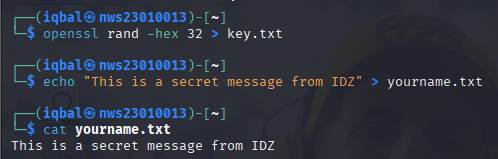
```sh
# Encrypting the file & Decrypting the file
┌──(iqbal㉿nws23010013)-[~]
└─$ openssl enc -aes-256-cbc -salt -pbkdf2 -in yourname.txt -out yourname.txt.enc -pass file:./key.txt                                                                                                                   
┌──(iqbal㉿nws23010013)-[~]
└─$ openssl enc -d -aes-256-cbc -pbkdf2 -in yourname.txt.enc -out yourname_decrypted.txt -pass file:./key.txt
```
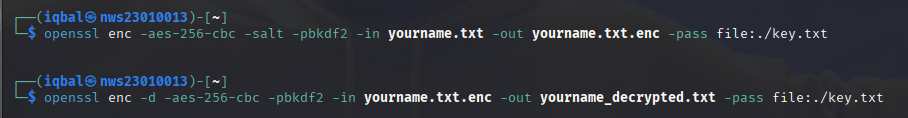

```sh
# Showing both files with `cat`
┌──(iqbal㉿nws23010013)-[~]
└─$ cat yourname.txt                                                                                  
This is a secret message from IDZ
┌──(iqbal㉿nws23010013)-[~]
└─$ cat yourname_decrypted.txt                                                                        
This is a secret message from IDZ
```
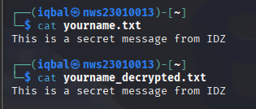

```sh
# yourname.txt.enc
┌──(iqbal㉿nws23010013)-[~]
└─$ cat yourname.txt.enc      
Salted__4j
          vE▒��]4X�԰��K/Ij��[����&��JK�����g��"��_��    
```
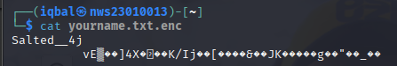

### 📸 Screenshots you must take:
- Creating the key
- Encrypting the file
- Decrypting the file
- Showing both files with `cat`

---

## **🛠 Task 2: Encrypt and Decrypt using Public and Private Keys (Asymmetric Encryption with RSA)**

### 📦 Tools:
- **OpenSSL** commands: `openssl genpkey`, `openssl rsa`, `openssl rsautl`

### 🚀 What we're doing:
- Create a pair of keys (🔑🔑: public and private).
- Lock the file with the **public key**.
- Unlock it with the **private key**.

### 📝 Step-by-step:

1. **Make a private key (only you have it)**:
```bash
openssl genpkey -algorithm RSA -out private.pem -pkeyopt rsa_keygen_bits:2048
```
> 🔑 You now have `private.pem`!

2. **Make a public key (can be shared with others)**:
```bash
openssl rsa -pubout -in private.pem -out public.pem
```
> 📢 This gives you `public.pem`.

3. **Create a message**:
```bash
echo "Secret message from Labu to Labi." > rahsia.txt
```
> ✉️ Message saved in `rahsia.txt`.

4. **Lock (encrypt) the message using the public key**:
```bash
openssl pkeyutl -encrypt -pubin -inkey public.pem -in rahsia.txt -out rahsia.enc
```
> 🔒 Now it’s locked and saved as `rahsia.enc`.

5. **Unlock (decrypt) the message using the private key**:
```bash
openssl pkeyutl -decrypt -inkey private.pem -in rahsia.enc -out rahsia_decrypted.txt
```
> 🔓 Message is now back to normal inside `rahsia_decrypted.txt`.

6. **Compare the files**:
```bash
cat rahsia.txt
cat rahsia_decrypted.txt
```
> ✅ The original and decrypted messages must be the same.

**result screenshot:**
```sh
# Private and public key creation
┌──(iqbal㉿nws23010013)-[~]
└─$ openssl genpkey -algorithm RSA -out private.pem -pkeyopt rsa_keygen_bits:2048
.....+........+......+.......+...+............+..+...+++++++++++++++++++++++++++++++++++++++*...........+....+............+............+.....+.......+++++++++++++++++++++++++++++++++++++++*..+..........+.................+.......+...+......+......+.....+.+..++++++
.....+............+...+..+++++++++++++++++++++++++++++++++++++++*.+.+++++++++++++++++++++++++++++++++++++++*...+.+..+...+....+......+..+......+.+...+..+.............+......+......++++++
┌──(iqbal㉿nws23010013)-[~]
└─$ openssl rsa -pubout -in private.pem -out public.pem
writing RSA key
```
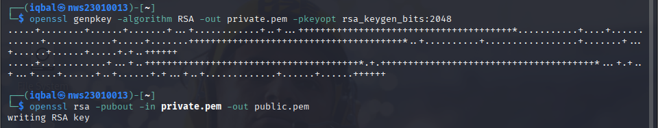

```sh
# Encryption & Decryption
┌──(iqbal㉿nws23010013)-[~]
└─$ openssl pkeyutl -encrypt -pubin -inkey public.pem -in rahsia.txt -out rahsia.enc
┌──(iqbal㉿nws23010013)-[~]
└─$ openssl pkeyutl -decrypt -inkey private.pem -in rahsia.enc -out rahsia_decrypted.txt
```
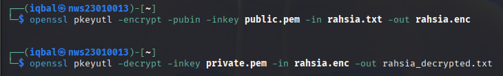

```sh
# `cat` the files to show messages
┌──(iqbal㉿nws23010013)-[~]
└─$ cat rahsia.txt
Secret message from IDZ to ZYMM.
┌──(iqbal㉿nws23010013)-[~]
└─$ cat rahsia_decrypted.txt
Secret message from IDZ to ZYMM.
```
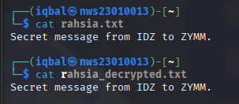

### 📸 Screenshots you must take:
- Private and public key creation
- Encryption
- Decryption
- `cat` the files to show messages

---

## **🛠 Task 3: Check if a File is Changed (Hashing with SHA-256)**

### 📦 Tools:
- OpenSSL (`openssl dgst`)
- OR simple Linux tool: `sha256sum`

### 🚀 What we're doing:
- Create a **fingerprint** (hash) of a file.
- See if it changes if someone tampers with the file.

### 📝 Step-by-step:

1. **Make a file**:
```bash
echo "Name: <Your Name>, ID: <Your ID>" > integrity.txt
```
> 📄 File created!

2. **Make a SHA-256 fingerprint**:
```bash
openssl dgst -sha256 integrity.txt
```
OR
```bash
sha256sum integrity.txt
```
> 🔍 This fingerprint (hash) represents the file.

3. **Change (tamper) the file**:
```bash
echo "Modified slightly." >> integrity.txt
```
> 🛠 We just changed the file.

4. **Check the fingerprint again**:
```bash
openssl dgst -sha256 integrity.txt
```
> 😲 The fingerprint will **change** even for small edits!

**result screenshot:**
```sh
# Hash of the original file
┌──(iqbal㉿nws23010013)-[~]
└─$ openssl dgst -sha256 integrity.txt
SHA2-256(integrity.txt)= 14806ef6a571a39b17e6bc29b53dfb2491d3c9dc58697e212d7ac6304cf64df8
```
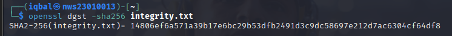

```sh
# Hash after tampering
┌──(iqbal㉿nws23010013)-[~]
└─$ openssl dgst -sha256 integrity.txt
SHA2-256(integrity.txt)= af2e5595fa5df03495ff2be3c67f009faffc9552e18be476ec974694aa446805
```
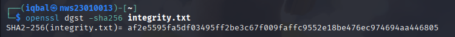

### 📸 Screenshots you must take:
- Hash of the original file
- Hash after tampering

### 🧠 Why? (Simple explanation):
- **If the file is edited even a little, the hash changes completely.**  
- This is how computers check if something has been secretly changed.

---

## **🛠 Task 4: Sign and Verify a File (Digital Signatures with RSA)**

### 📦 Tools:
- OpenSSL (`openssl dgst`, `openssl pkeyutl`)

### 🚀 What we're doing:
- Sign a file using your private key 🔏.
- Check if the file is **real and unchanged** using the public key.

### 📝 Step-by-step:

1. **Use your private key (`private.pem`)**.

2. **Make a file to sign**:
```bash
echo "This is the signed agreement." > agreement.txt
```
> ✍️ File ready!

3. **Sign the file**:
```bash
openssl dgst -sha256 -sign private.pem -out agreement.sig agreement.txt
```
> 🖊 This produces a `agreement.sig` signature!

4. **Verify the signature**:
```bash
openssl dgst -sha256 -verify public.pem -signature agreement.sig agreement.txt
```
> ✅ If everything is good, you will see: `Verified OK`.

5. **Tamper with the file**:
```bash
echo "Tampered!" >> agreement.txt
```
> 🛠 Change the file.

6. **Try to verify again**:
```bash
openssl dgst -sha256 -verify public.pem -signature agreement.sig agreement.txt
```
> ❌ Now it will fail because the file was changed!

**result screenshot:**
```sh
# Signing the file
┌──(iqbal㉿nws23010013)-[~]
└─$ echo "This is the signed agreement." > agreement.txt
┌──(iqbal㉿nws23010013)-[~]
└─$ openssl dgst -sha256 -sign private.pem -out agreement.sig agreement.txt
```
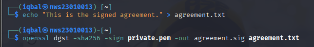

```sh
# Successful verification
┌──(iqbal㉿nws23010013)-[~]
└─$ openssl dgst -sha256 -verify public.pem -signature agreement.sig agreement.txt
Verified OK
```
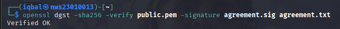

```sh
# Failed verification after tampering
┌──(iqbal㉿nws23010013)-[~]
└─$ openssl dgst -sha256 -verify public.pem -signature agreement.sig agreement.txt
Verification failure
4097BF5F557F0000:error:02000068:rsa routines:ossl_rsa_verify:bad signature:../crypto/rsa/rsa_sign.c:442:
4097BF5F557F0000:error:1C880004:Provider routines:rsa_verify_directly:RSA lib:../providers/implementations/signature/rsa_sig.c:1041:
```
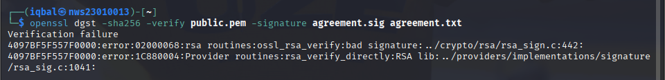

### 📸 Screenshots you must take:
- Signing the file
- Successful verification
- Failed verification after tampering

### 🧠 Why? (Simple explanation):
- **Signatures prove that the file is from you and has NOT been changed.**

---

## 🛠 Troubleshooting (Simple fixes)

✅ If you see an error:

| Error message | Meaning | How to fix |
| :--- | :--- | :--- |
| `bad decrypt` | Wrong password or key used | Double-check your key! |
| `Verification Failure` | File changed after signing | Make sure the file wasn't touched. |
| `No such file or directory` | You typed wrong filename | Check spelling carefully. |

---

## 📚 Helpful Resources:
- [OpenSSL Official Docs](https://www.openssl.org/docs/)
- `man openssl` command inside terminal
- Ask Google or StackOverflow for help!
