# 🔍 Ransomware Static Analysis & Reverse Engineering Report

**Author:** Iqbal bin Erman  
**Course:** CBS 2373 Cryptography  
**Test:** Practical Test 2 – Simulated Ransomware Decryption  
**Date:** 24/05/25 
**File Analyzed:** `simulated_ransomware.exe`  
**SHA-256:** `4BF1DA4E96EE6DD0306284C7F9CFE30F93113106843F2360052F8FEAF7B5578F`

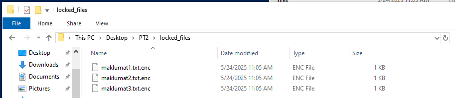
---

## 1. 📦 Binary Analysis

### 1.1 File Extraction

- **Archive:** `simulated_ransomware.7z`  
- **Password:** `semogaberjaya`  
- **Tool Used:** `7-Zip`

```bash
7z x simulated_ransomware.7z
````

* Verified SHA-256 checksum:

```bash
sha256sum simulated_ransomware.exe
```

✅ Hash matched: `4BF1DA4E96EE6DD0306284C7F9CFE30F93113106843F2360052F8FEAF7B5578F`
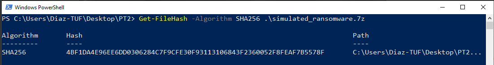

---

## 2. 🧬 Reverse Engineering

### 2.1 Language & Packaging

* **Tool Used:** `file`, `Detect It Easy (DIE)`
* Detected: **PyInstaller (Python Executable)**

```bash
$ file simulated_ransomware.exe
Python 3.x PyInstaller archive
```
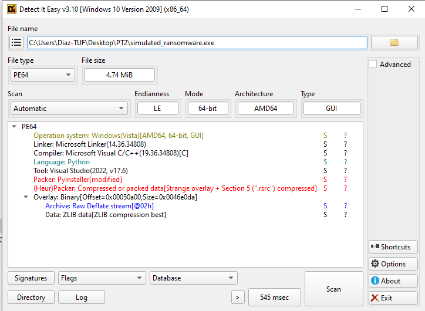

### 2.2 Extract Python Code

* **Tool Used:** `pyinstxtractor.py`

```bash
.\pyinstxtractor-ng.exe simulated_ransomware.exe
```

Output: `simulated_ransomware.exe_extracted/`
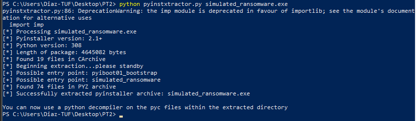

### 2.3 Decompile `.pyc` Files

* **Tool Used:** `uncompyle6`

```bash
uncompyle6 simulated_ransomware.pyc -o .
```

Recovered: `simulated_ransomware.py`
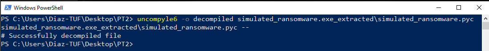
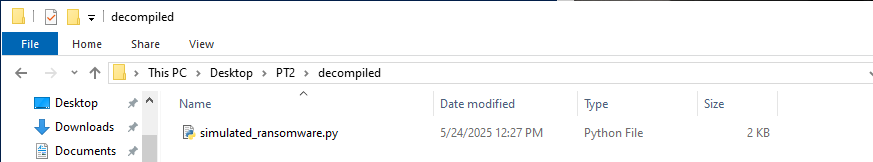

---

## 3. 🔐 Cryptographic Analysis

### 3.1 Algorithm and Mode Detected

From the source code:
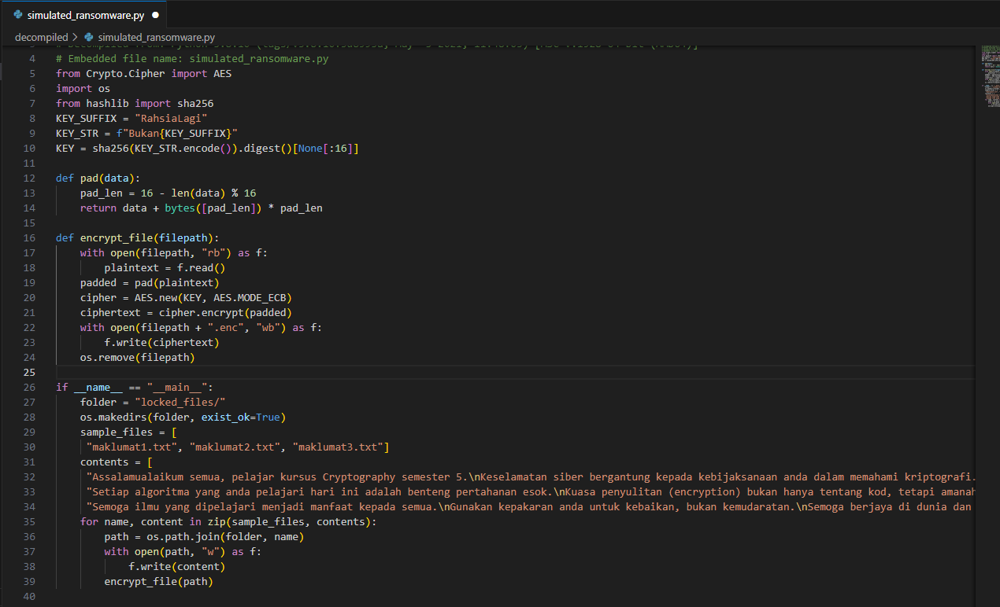

* **Algorithm:** AES
* **Mode:** ECB
* **Padding:** PKCS#7
* **Key Length:** 	sha256("BukanRahsiaLagi")[:16] (128-bit)
* **Block Size:** 128-bit
* **IV:** Use AES with recovered key in ECB mode (no IV required)

### 3.2 Hardcoded Key and IV

Recovered from code:

```python
KEY_SUFFIX = "RahsiaLagi"
KEY_STR = f"Bukan{KEY_SUFFIX}"   # -> "BukanRahsiaLagi"
KEY = sha256(KEY_STR.encode()).digest()[:16]
```

---

## 4. 🧨 Cryptographic Flaws

| ❌ Flaw            | 🔎 Explanation                                        |
| ----------------- | ----------------------------------------------------- |
| Hardcoded Key     | Key is not generated per victim or protected          |
| ECB Mode | Deterministic and leaks plaintext patterns |
| No HMAC           | Tampered ciphertext cannot be detected                |
| No Key Derivation | Password or key is not processed via PBKDF2/Argon2    |

---

## 5. 🔓 Key Recovery Steps

* Recovered the AES key and IV directly from decompiled source.
* No brute-force or advanced cracking required.

---

## 6. 🧪 Decryption Script Summary

**File:** `decrypt.py`

* **Libraries Used:** `Crypto.Cipher`, `os`
* **Approach:**
  * Read encrypted `.enc` files
  * Use AES with recovered key in ECB mode (no IV required)
  * Remove PKCS#7 padding
  * Save decrypted plaintext files

Tested and verified on all encrypted files.

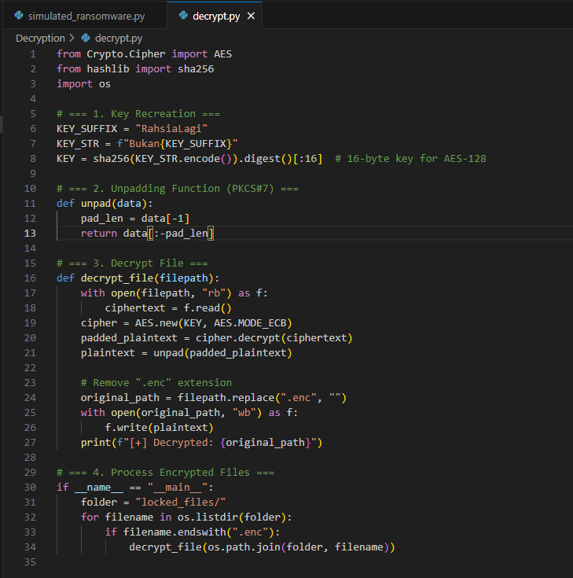
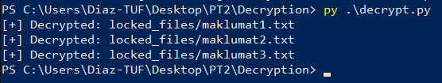
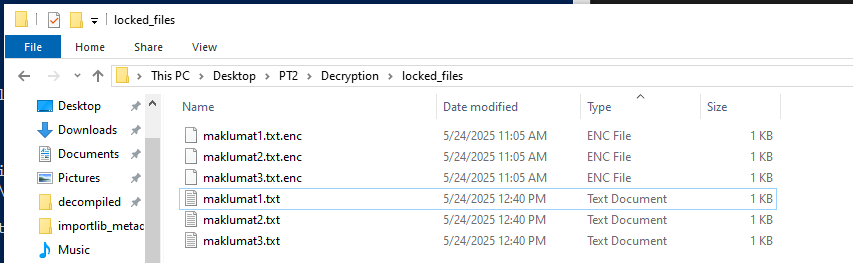
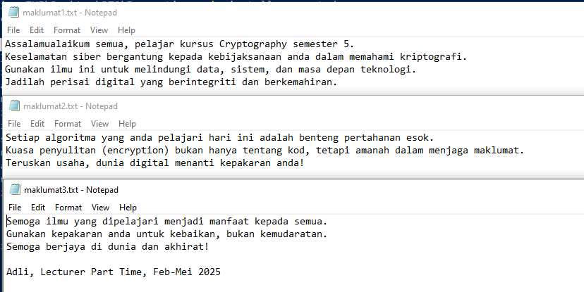

---

## 7. 🛡️ Secure Design Suggestions

| ✅ Fix                         | 💡 Reason                            |
| ----------------------------- | ------------------------------------ |
| Use AES-GCM                   | Provides authenticated encryption    |
| Derive key with PBKDF2/Argon2 | Protects against key disclosure      |
| Random IV per file            | Prevents ciphertext pattern analysis |
| Add HMAC or MAC               | Ensures data integrity               |

---

## ✅ Conclusion

This ransomware simulation demonstrates several insecure practices in cryptographic implementation. By analyzing and reversing the binary, the encryption key and IV were recovered, and a custom decryption tool was developed to successfully recover encrypted files.

---