## Task 1: Generate Your GPG Key Pair

Objective: Use `gpg` to generate an RSA key pair tied to your identity.

- Input:

- Name: Iqbal Bin Erman
- Email: iqbal.erman@student.gmi.edu.my
- Key Type: RSA
- Key Size: 4096 bits
- Expiry: 1y

- Expected Output: GPG key fingerprint, with `gpg --list-keys` showing your identity.

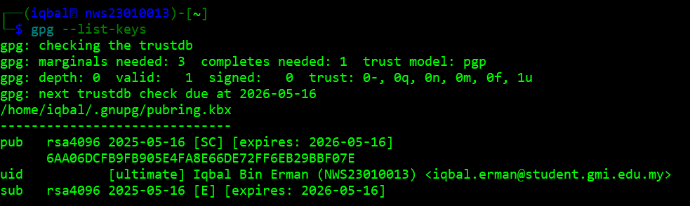

## Task 2: Encrypt and Decrypt a File

Objective: Perform GPG encryption and decryption.

- Create a file `message.txt` containing:
`This file was encrypted by Iqbal Bin Erman (NWS23010013)`

- Encrypt `message.txt` using your own public key (for self-decryption).

- Decrypt the resulting file and verify the contents.

- Expected Output: Clear file content recovered.

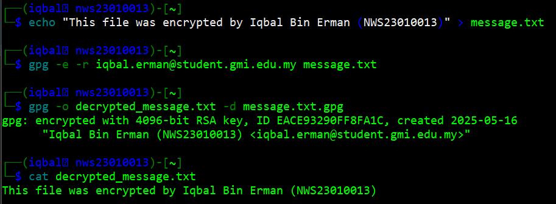

## Task 3: Sign and Verify a Message

Objective: Digitally sign a message and verify its authenticity.

- Step A: Create a signed message file `signed_message.txt` that contains:
`I, Iqbal Bin Erman, declare this is my work.`

- Step B: Sign the file using GPG (`--clearsign` or `--detach-sign`)

- Step C: Verify your signature using `gpg --verify`

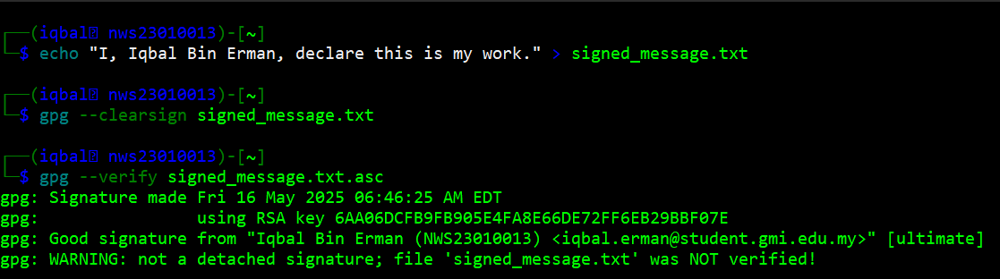

## Task 4: Configure Passwordless SSH Authentication

Objective: Set up SSH key-based login to a simulated server (or localhost if isolation is used).

- Generate an SSH key pair using your name and ID as comment.
`ssh-keygen -C "Iqbal Bin Erman-NWS23010013"`

- Configure passwordless login to a test VM or localhost (`~/.ssh/authorized_keys`).

- Test authentication by logging in and creating a file `Iqbal_Erman.txt` containing “[NWS23010013]”

- Evidence Required:

- Show the SSH key comment in the public key.
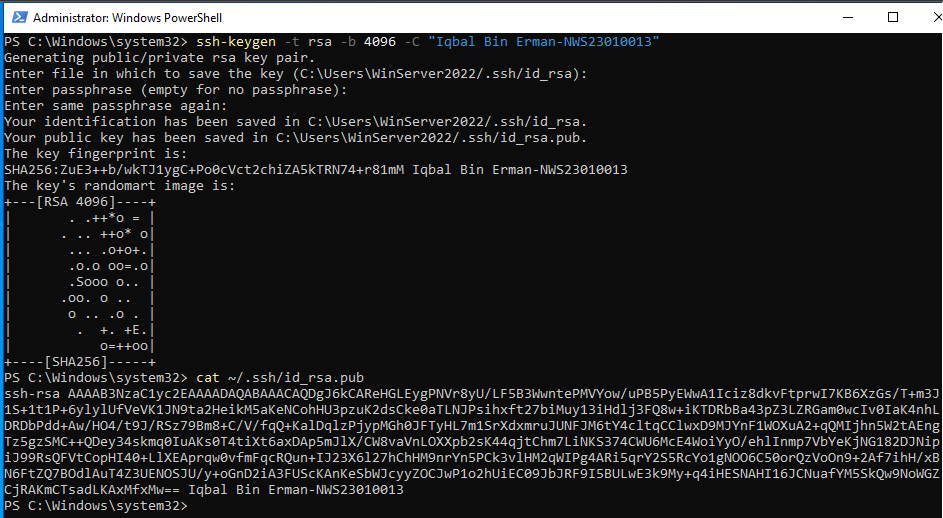
- Show login command working without password.
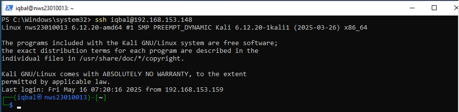
- Screenshot of `ssh user@ssh-server "echo NWS23010013 > Iqbal_Erman.txt"` from your local computer
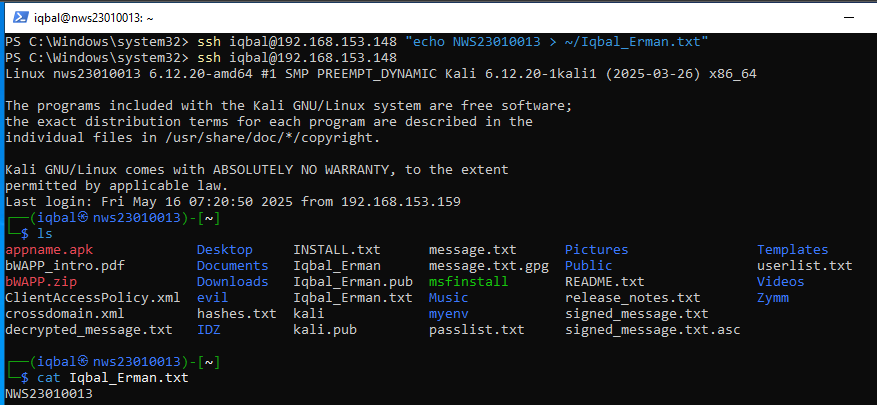
- Screenshot of `whoami` from remote shell.
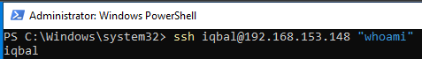

## Task 5: Hash Cracking Challenge

### Objective: Crack provided hashes.

Hashes Provided (Variety of types):

- SnZlcmV4IEF2IEpmcmNyZSBFeiBCcnJl
- 7b77ca1e2b3e7228a82ecbc7ca0e6b52
- e583cee9ab9d7626c970fd6e9938fcb2d06fbbd12f1c1a3c6902a215808c825c

Expected Output:

- SnZlcmV4IEF2IEpmcmNyZSBFeiBCcnJl → Base64
(Senang Je Soalan Ni Kaan)
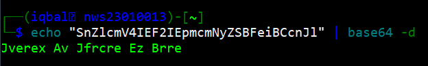
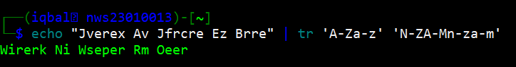
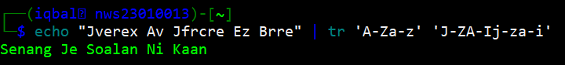
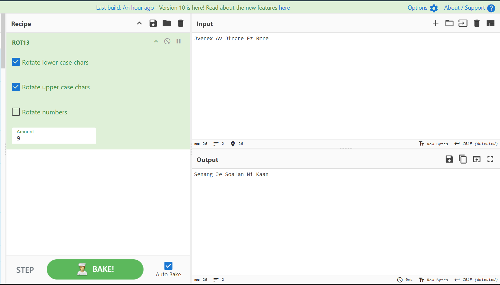

- 7b77ca1e2b3e7228a82ecbc7ca0e6b52 → MD5
(Assalamualaikum Semua)
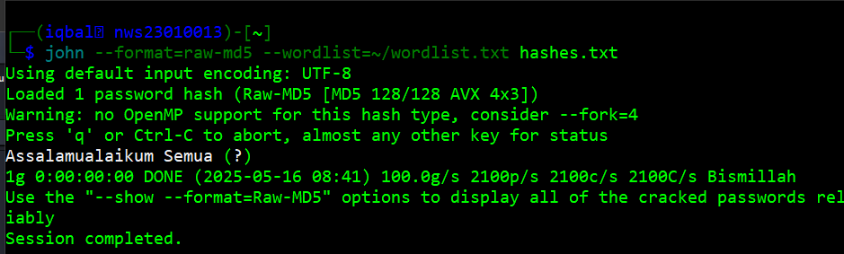

- 2bc92f33a2ede5ada3d65b468a81f617d0229d843d87c63313833e509e5a6782 → SHA-256
(Bismillah)
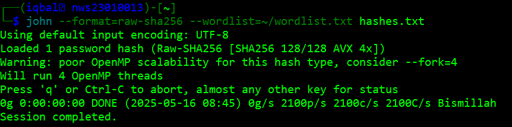